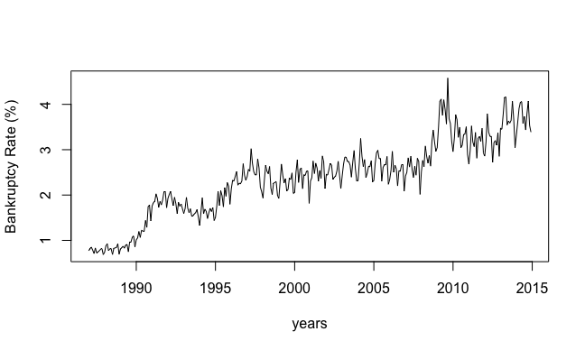
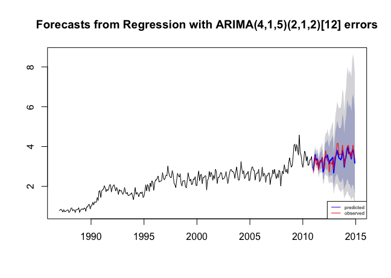
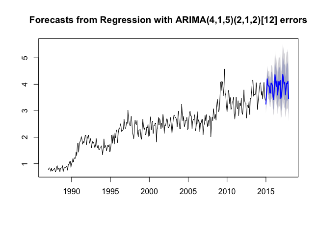

# Canada Bankruptcy Rate Prediction

A time series project to forecast the personal bankruptcy rate in Canada. Model performance ranked 3rd among more than 20 groups. Check the [report](Canada_BankruptcyRate_Prediction.pdf) for details    
     
**Authors:** Paul Kim, Jacques Sham, Brian Wright, and Xi Yang      
**Date:** December 2018

## Table of Content
- Project Goal
- Data Source
- Modeling
	- Univariate Model
	- Multivariate Model
	- Results
- Summary

## Project Goal
Our goal in this report is to use different time series approaches to learn an optimal model from the training data and use this model with the test data to forecast the national bankruptcy rate in Canada between January2015 and December 2017.      
          
## Data Source.     
unemployment rate, population, housing price index    

- Training: 1987 to 2010    
- Validation Set: 2011 to 2014
- Plot of bankruptcy rate      

## Modeling
### Univariate Model
   
- Box-Jenkins Method     
- Holt-Winters Method  
          
### Multivariate Model
     
- Exogenous: Box-Jenkins Method
- Endogenous: Vector Autoregressive Model (VAR)

### Results     
   
|Model | RMSE | Variance |
|:----:|:----:|:--------:|
|Box-Jenkins | .229 | 0.0046 |
|Holt-Winters | .276 | 0.177 |
|**SARIMAX(4, 1, 5)*(2, 1, 2)** | **.206** | 0.0048 |
|VAR(2) | .297 | Does not apply|

It turns out that SARIMAX performs the best with RMSE 0.206. The predicted bankruptcy rate and the real bankruptcy rate from 2011 to 2014 shows as follows:    
     

The residuals plot and ACF plot shows that the model is consistent with the time series model      
   
     
## Summary
The forecasting bankruptcy rate based on this model is plotted in Fig below.  The blue line represents the mean of the prediction.  The shadows represent different prediction intervals, which are estimates  of  an  interval  in  which  a  future  observation  will  fall  with  a  certain  probability.   The  dark  shadow represents the 80% prediction interval and the light shadow represents the 95% prediction interval.  Based on our  prediction  results,  the  mean  value  of  personal  bankruptcy  rate  ranges  from  3  to  a  little  above  4.   The bankruptcy  rate  is  relative  stable  compared  with  previous  years,  which  contributes  to  economic  stability  inCanada.  According to our prediction intervals, with 95% probability, the personal bankruptcy rates from 2015to 2017 ranges from 3 to 5.  The bankruptcy rate will not exceed 5 with 95% probability, which is a good signal for the economy in Canada.     

     
   
To conclude:  our best performing model was the SARIMAX(4,1,5)(2,1,2) model.  This model gave us the lowestRMSE on our validation set.  Our SARIMAX model predicts that bankruptcy rate in Canada during 2015-2017will increase overall but not by very much, while still exhibiting seasonality.  Though SARIMAX does not takeinto account the likely endogeneity of the house-price index and unemployment rate variables, it outperformedthe VAR model.  We may then conclude that the influence of the response variable on the explanatory variablesmay not be enough to justify usage of a VAR model.         